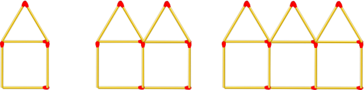

# Easy Challenges

## 1. Operações bit a bit

    Um número decimal pode ser representado como uma sequência de bits. Ilustrar:

    6 = 00000110
    23 = 00010111
    A partir da representação bit a bit dos números, podemos calcular o AND bit a bit, o OR bit a bit e o XOR bit a bit. Usando o exemplo acima:

    bit a bitAND(6, 23) ➞ 00000110

    OR bit a bit (6, 23) ➞ 00010111

    bit a bitXOR(6, 23) ➞ 00010001
    Escreva três funções para calcular AND bit a bit, OR bit a bit e XOR bit a bit de dois números.

    Exemplos:

    bitwiseAND(7, 12) ➞ 4

    bitwiseOR(7, 12) ➞ 15

    bitwiseXOR(7, 12) ➞ 11

    Lembrete:

    JavaScript tem uma função útil: toString(2), onde você pode ver a representação binária de um número decimal.

## 2. Some os números de um único número

    Crie uma função que receba um número como argumento. Some todos os números de 1 ao número que você passou para a função. Por exemplo, se a entrada for 4, sua função deverá retornar 10 porque 1 + 2 + 3 + 4 = 10.

    Exemplos:

    addUp(4) ➞ 10

    addUp(13) ➞ 91

    addUp(600) ➞ 180300

    Lembrete:

    Espere qualquer número positivo entre 1 e 1000.

## 3. Casas de palito de fósforo

    Este desafio o ajudará a interpretar relações matemáticas tanto algébrica quanto geométricamente.

    Crie uma função que receba um número (passo) como argumento e retorne o número de palitos de fósforo nesse passo. Veja as etapas 1, 2 e 3 na imagem acima.

    Exemplos:

    matchHouses(1) ➞ 6

    matchHouses(4) ➞ 21

    matchHouses(87) ➞ 436

    Lembrete:

    A etapa 0 retorna 0 palitos de fósforo.
    A entrada (etapa) sempre será um número inteiro não negativo.
    Pense na entrada (etapa) como o número total de casas que foram conectadas entre si.

## 4. Deslocamento para a esquerda por potências de dois

    A operação de deslocamento para a esquerda é semelhante à multiplicação por potências de dois.

    Cálculo de amostra usando o operador de deslocamento para a esquerda (<<):

    10 << 3 = 10 * 2 ^ 3 = 10 * 8 = 80
    -32 << 2 = -32 * 2 ^ 2 = -32 * 4 = -128
    5 << 2 = 5 * 2 ^ 2 = 5 * 4 = 20

    Escreva uma função que imite (sem o uso de <<) o operador de deslocamento para a esquerda e retorne o resultado dos dois inteiros fornecidos.

    Exemplos:

    shiftToLeft(5, 2) ➞ 20

    shiftToLeft(10, 3) ➞ 80

    shiftToLeft(-32, 2) ➞ -128

    shiftToLeft(-6, 5) ➞ -192

    shiftToLeft(12, 4) ➞ 192

    shiftToLeft(46, 6) ➞ 2944

    Lembrete:

    Não haverá valores negativos para o segundo parâmetro y.
    Este desafio é mais como uma recriação da operação de deslocamento para a esquerda, portanto, o uso direto do operador é proibido.
    Alternativamente, você pode resolver esse desafio por meio de recursão.

## 5. Recursão: deslocamento para a esquerda por potências de dois

    A operação de deslocamento para a esquerda é semelhante à multiplicação por potências de dois, portanto, o processo é repetitivo e pode ser feito recursivamente.

    Cálculo de amostra usando o operador de deslocamento para a esquerda (<<):

    10 << 3 = 10 * 2 ^ 3 = 10 * 8 = 80
    -32 << 2 = -32 * 2 ^ 2 = -32 * 4 = -128
    5 << 2 = 5 * 2 ^ 2 = 5 * 4 = 20

    Escreva uma função recursiva que imite (sem o uso de <<) o operador de deslocamento para a esquerda e retorne o resultado dos dois inteiros fornecidos.

    Exemplos:

    shiftToLeft(5, 2) ➞ 20

    shiftToLeft(10, 3) ➞ 80

    shiftToLeft(-32, 2) ➞ -128

    shiftToLeft(-6, 5) ➞ -192

    shiftToLeft(12, 4) ➞ 192

    shiftToLeft(46, 6) ➞ 2944

    Lembrete:

    Não haverá valores negativos para o segundo parâmetro y.
    Este desafio é mais como uma recriação da operação de deslocamento para a esquerda, portanto, o uso direto do operador é proibido.
    Espera-se que você resolva esse desafio por meio de recursão.

## 6. Encontre os menores e maiores números

    Crie uma função que receba um array de números e retorne os números mínimo e máximo, nessa ordem.

    Exemplos:

    minMax([1, 2, 3, 4, 5]) ➞ [1, 5]

    minMax([2334454, 5]) ➞ [5, 2334454]

    minMax([1]) ➞ [1, 1]

    Lembrete:

    Todas as matrizes de teste terão pelo menos um elemento e são válidas.

## 7. É hora de leite e biscoitos?

    A véspera de Natal está quase chegando, então naturalmente precisamos preparar leite e biscoitos para o Papai Noel! Crie uma função que aceite um objeto Date e retorne verdadeiro se for véspera de Natal (24 de dezembro) e falso caso contrário. Tenha em mente que o mês da data do JavaScript é baseado em 0, o que significa que dezembro é o 11º mês, enquanto janeiro é 0.

    Exemplos:

    timeForMilkAndCookies(new Date(2013, 11, 24)) ➞ true

    timeForMilkAndCookies(new Date(2013, 0, 23)) ➞ false

    timeForMilkAndCookies(new Date(3000, 11, 24)) ➞ true

    Lembrete:

    As datas são baseadas em zero (consulte recursos).
    Todos os casos de teste contêm datas válidas.

## 8. Qual função retorna o número maior?

    Sua função receberá duas funções, f e g, que não aceitam nenhum parâmetro. Sua função deve chamá-los e retornar uma string que indica qual função retornou o número maior.

    Se f retornar o número maior, retorne a string f.
    Se g retornar o número maior, retorne a string g.
    Se as funções retornarem o mesmo número, não retorne a string.

    Exemplos:

    whichIsLarger(() => 5, () => 10) ➞ "g"

    whichIsLarger(() => 25,  () => 25) ➞ "neither"

    whichIsLarger(() => 505050, () => 5050) ➞ "f"

    Lembrete:

    Este exercício foi concebido como uma introdução às funções de ordem superior (funções que utilizam outras funções para realizar o seu trabalho).

## 9. Converter um número em Base 2

    Crie uma função que retorne uma representação de base 2 (binária) de um número de string de base 10 (decimal). Converter é simples: ((2) significa base 2 e (10) significa base 10) 010101001(2) = 1 + 8 + 32 + 128.

     Indo da direita para a esquerda, o valor do bit mais à direita é 1, agora a partir disso cada bit à esquerda será x2 o valor, o valor de um número binário de 8 bits é (256, 128, 64, 32, 16, 8 , 4, 2, 1).

    Exemplos:

    binary(1) ➞ "1"
    // 1*1 = 1

    binary(5) ➞ "101"
    // 1*1 + 1*4 = 5

    binary(10) ➞ "1010"
    // 1*2 + 1*8 = 10

    Lembrete:

    Os números estarão sempre abaixo de 1.024 (sem incluir 1.024).
    O operador && pode ser útil.
    As strings sempre terão o comprimento em que o valor do bit mais à esquerda fica maior que o número em decimal.
    Se for tentada uma conversão binária para 0, retorne "0".

## 10. Verifique se um array pode ser aninhado em outro

    Crie uma função que retorne verdadeiro se o primeiro array puder ser aninhado dentro do segundo e falso caso contrário.

    arr1 pode ser aninhado dentro de arr2 se:
        O mínimo de arr1 é maior que o mínimo de arr2.
        O máximo de arr1 é menor que o máximo de arr2.

    Exemplos:

    canNest([1, 2, 3, 4], [0, 6]) ➞ true

    canNest([3, 1], [4, 0]) ➞ true

    canNest([9, 9, 8], [8, 9]) ➞ false

    canNest([1, 2, 3, 4], [2, 3]) ➞ false

    Lembrete:

    Observe a desigualdade estrita

## 11. Promises III: Promessa Nativa, Apresentando o Executor

    Promessas são apenas objetos que contêm o resultado de operações assíncronas. Então, quando você usa um? Quando você deseja controlar o resultado de uma operação assíncrona. Tudo o que você precisa fazer é agrupar a função assíncrona com um construtor de promessa.

    O construtor da promessa requer que você passe uma função chamada executor que recebe dois parâmetros, resolver e rejeitar. Ambas são funções que você usa para passar ou rejeitar um valor que geralmente é o resultado da operação assíncrona. Aqui está um exemplo de uma promessa simples:

    let promise = new Promise( (resolve, reject) => {
      setTimeout(( ) => {
         resolve("edabit")
      }, 1000)
    })

    setTimeout é uma API de navegador muito comumente usada em tutoriais para representar operações assíncronas. Após 1000ms, chamamos a função de retorno de chamada em setTimeout() e passamos uma string "edabit" para a função de resolução.

    Crie uma promessa simples e passe para a função de resolução um valor de string de sua escolha. Use a função setTimeout como sua operação assíncrona. Sua função setTimeout() não deve exceder 1000ms. Armazene a promessa dentro de uma variável chamada promessa.

## 12. Número de quadrados em uma grade N \* N

    Crie uma função que calcule o número de quadrados diferentes em uma grade quadrada n * n.

    Exemplos:

    numberSquares(2) ➞ 5

    numberSquares(4) ➞ 30

    numberSquares(5) ➞ 55

    Explicação:

    Se n = 0 então o número de quadrados é 0
    Se n = 1 então o número de quadrados é 1 + 0 = 1
    Se n = 2, então o número de quadrados é 2 ^ 2 + 1 = 4 + 1 = 5
    Se n = 3, então o número de quadrados é 3 ^ 3 + 5 = 9 + 5 = 14

    Como você pode ver, para cada valor de n o número de quadrados é n ao quadrado + o número de quadrados do valor anterior de n.

    Lembrete:

    A entrada é um número inteiro positivo.
    Número piramidal quadrado.

## 13. Soma da Resistência em Circuitos em Série

    Quando os resistores são conectados em série, a mesma corrente passa por cada resistor da cadeia e a resistência total, RT, do circuito deve ser igual à soma de todos os resistores individuais somados. Aquilo é:

    TR = R1 + R2 + R3 ...

    Crie uma função que pegue uma matriz de valores de resistência conectados em série e calcule a resistência total do circuito em ohms. O ohm é a unidade padrão de resistência elétrica no Sistema Internacional de Unidades (SI).

    Exemplos:

    seriesResistance([1, 5, 6, 3]) ➞ "15 ohms"

    seriesResistance([16, 3.5, 6]) ➞ "25.5 ohms"

    seriesResistance([0.5, 0.5]) ➞ "1.0 ohm"

    Lembrete:

    Todas as entradas serão válidas.
    Observe o ohm singular para valores <= 1.
    Este desafio foi inspirado no desafio Python Soma de Resistência em Circuitos Paralelos de Joshua Señoron.

## 14. Maior troca

    Escreva uma função que receba um número de dois dígitos e determine se é a maior das duas trocas de dígitos possíveis.

    Ilustrar:

    maiorSwap(27) ➞ falso
    maiorSwap(43) ➞ verdadeiro

    Se 27 for nossa entrada, devemos retornar falso porque trocar os dígitos nos dá 72 e 72 > 27. Por outro lado, trocar 43 nos dá 34 e 43 > 34.

    Exemplos:

    largestSwap(14) ➞ false

    largestSwap(53) ➞ true

    largestSwap(99) ➞ true

    Lembrete:

    Números com dois dígitos idênticos (terceiro exemplo) devem resultar em verdadeiros

## 15. O que está escondido entre a multidão?

    Uma palavra está à solta e agora tentou se esconder entre uma multidão de letras altas! Ajude a escrever uma função para detectar qual é a palavra, conhecendo as seguintes regras:

    A palavra desejada está em letras minúsculas.
    A multidão de letras está toda em maiúscula.
    Observe que a palavra ficará espalhada entre as letras aleatórias, mas suas letras permanecerão na mesma ordem.

    Exemplos:

    detectWord("UcUNFYGaFYFYGtNUH") ➞ "cat"

    detectWord("bEEFGBuFBRrHgUHlNFYaYr") ➞ "burglar"

    detectWord("YFemHUFBbezFBYzFBYLleGBYEFGBMENTment") ➞ "embezzlement"

## 16. Hexadecimal para Binário

    Crie uma função que receberá um número HEX e retornará o equivalente binário (como uma string).

    Exemplos:

    toBinary(0xFF) ➞ "11111111"

    toBinary(0xAA) ➞ "10101010"

    toBinary(0xFA) ➞ "11111010"

    Lembrete:

    O número será sempre um número de 8 bits.

## 17. Mais velho que eu

    Crie um método na classe Person que retorne a comparação da idade de outra pessoa. Dadas as instâncias p1, p2 e p3, que serão inicializadas com os atributos nome e idade, retorne uma frase no seguinte formato:

    {nome da outra pessoa} é {mais velho/menor que/mesma idade que} eu.

    Exemplos:

    p1 = Person("Samuel", 24)
    p2 = Person("Joel", 36)
    p3 = Person("Lily", 24)

    p1.compareAge(p2) ➞ "Joel is older than me."
    p2.compareAge(p1) ➞ "Samuel is younger than me."
    p1.compareAge(p3) ➞ "Lily is the same age as me."

## 18. Classificação de bebidas

    Você receberá uma variedade de bebidas, sendo cada bebida um objeto com duas propriedades: nome e preço. Crie uma função que tenha o array drinks como argumento e retorne os objetos drinks ordenados por preço em ordem crescente.

    Suponha que o seguinte array de objetos de bebida precise ser classificado:

    bebidas = [
        {nome: "limonada", preço: 50},
        {nome: "limão", preço: 10}
    ]

    A saída do objeto de bebidas classificadas será:

    Exemplos:

    sortDrinkByPrice(drinks) ➞ [{name: "lime", price: 10}, {name: "lemonade", price: 50}]

## 19. Coloque na matriz

    Crie uma função que receba dois arrays e insira o segundo array no meio do primeiro array.

    Exemplos:

    tuckIn([1, 10], [2, 3, 4, 5, 6, 7, 8, 9]) ➞ [1, 2, 3, 4, 5, 6, 7, 8, 9, 10]

    tuckIn([15,150], [45, 75, 35]) ➞ [15, 45, 75, 35, 150]

    tuckIn([[1, 2], [5, 6]], [[3, 4]]) ➞ [[1, 2], [3, 4], [5, 6]]

    Lembrete:

    A primeira matriz sempre possui dois elementos.
    Use a sintaxe de propagação para resolver este desafio.
